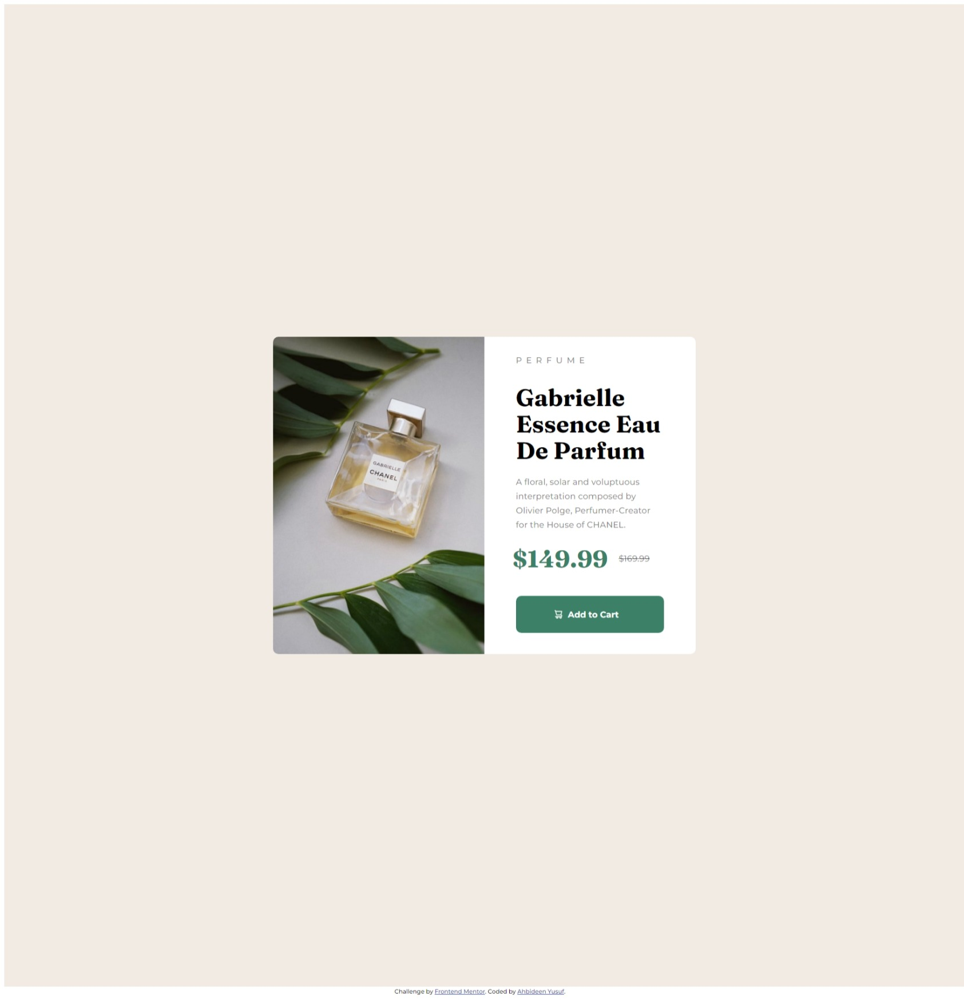

# Frontend Mentor - Product preview card component solution

This is a solution to the [Product preview card component challenge on Frontend Mentor](https://www.frontendmentor.io/challenges/product-preview-card-component-GO7UmttRfa). Frontend Mentor challenges help you improve your coding skills by building realistic projects.

## Table of contents

- [Overview](#overview)
  - [The challenge](#the-challenge)
  - [Screenshot](#screenshot)
  - [Links](#links)
- [My process](#my-process)
  - [Built with](#built-with)
  - [What I learned](#what-i-learned)
- [Author](#author)
- [Acknowledgments](#acknowledgments)

## Overview

### The challenge

Users should be able to:

- View the optimal layout depending on their device's screen size
- See hover and focus states for interactive elements

### Screenshot

### Links

- Solution URL: [Add solution URL here](https://your-solution-url.com)
- Live Site URL: [Add live site URL here](https://your-live-site-url.com)

## My process

### Built with

- Semantic HTML5 markup
- CSS custom properties
- Flexbox
- CSS Grid
- Mobile-first workflow

### What I learned

I learned to how mix up the usage of flexbox and grid. This project made me realize,
that flexbox is useful if you want your layout to be horizontal or vertical.
I initial it works more like grid but know I understand the exact difference.

## Author

- Website - [Ahbideen Yusuf]
- Frontend Mentor - [@bravono](https://www.frontendmentor.io/profile/bravono)
- Twitter - [@yahbideen](https://twitter.com/YAhbideen)

## Acknowledgments

I learned from Mosh Hammadani's course on codewithmosh.com. He's a great guy and
he definitly know how to teach to understand. Whenever I stucked on anything I just
go back to his well curated course and rewatch the part that I want.
